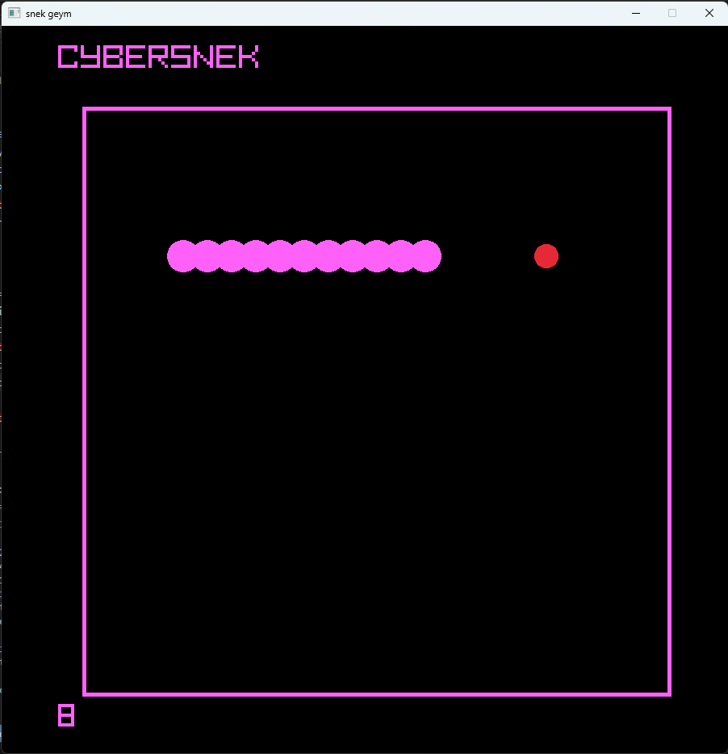

# CYBERSNEK



CYBERSNEK is a neon-styled Snake game built in C++ with [raylib](https://www.raylib.com/). The game follows the classic Snake loop: guide the snake around the playfield, eat food to grow longer, avoid hitting the wall or your own tail, and keep chasing a higher score.

The project was created as a graphics programming activity and uses raylib for the game window, rendering, keyboard input, timing, vector math, and sound playback.

## Features

- Classic Snake movement using the arrow keys.
- Smooth game loop with a fixed movement interval.
- Neon cyber-themed visuals with a black background, pink playfield border, and circular snake body segments.
- Random food placement that avoids spawning on the snake body.
- Score tracking displayed below the playfield.
- Collision handling for walls and the snake tail.
- Game reset after collision, with movement restarting when the player presses an arrow key.
- Sound effects for eating food and hitting a wall.
- Executable-relative asset loading so audio files can be found after building.

## Controls

| Key         | Action     |
| ----------- | ---------- |
| Up Arrow    | Move up    |
| Down Arrow  | Move down  |
| Left Arrow  | Move left  |
| Right Arrow | Move right |

The snake cannot reverse directly into itself. For example, if it is moving right, pressing left immediately will be ignored.

## Project Structure

```text
Snake_Graphics/
+-- 1T Finals Graphics/
|   +-- nomnom.mp3
|   +-- wallcollision.mp3
|   +-- foodcircle.png
+-- Finals_GRAPHICS/
|   +-- Finals_GRAPHICS.sln
|   +-- Finals_GRAPHICS/
|   |   +-- Finals_GRAPHICS.cpp
|   |   +-- Finals_GRAPHICS.vcxproj
|   +-- x64/Debug/
|       +-- Finals_GRAPHICS.exe
|       +-- raylib.dll
|       +-- glfw3.dll
|       +-- assets/
|           +-- nomnom.mp3
|           +-- wallcollision.mp3
+-- .vscode/
    +-- c_cpp_properties.json
    +-- launch.json
    +-- tasks.json
```

## Build and Launch

Open this folder in VS Code:

```text
\Snake_Graphics
```

Build the project:

```text
Ctrl + Shift + B
```

Launch the game:

```text
F5
```

Choose `Launch Snake Graphics` if VS Code asks for a debug configuration.

Avoid using `C/C++: cl.exe build active file`, because that only compiles the active `.cpp` file and skips the Visual Studio project settings needed for raylib, C++17, DLL copying, and asset copying.

## Dependencies

- C++17
- Visual Studio Build Tools with the installed `v145` platform toolset
- raylib from vcpkg
- glfw3 from vcpkg, used by raylib on Windows

The project expects vcpkg to be located beside `Snake_Graphics`:

```text
C:\GitHub\vcpkg
```

## Improvements Made Today

The initial project had several launch and configuration issues that could prevent it from building or running correctly in VS Code. These were addressed so the project can build through MSBuild and launch from the generated executable folder.

### Build Configuration

- Added explicit raylib include paths to the Visual Studio project.
- Added explicit raylib library paths for linking.
- Set the project language standard to C++17 so `<filesystem>` works correctly.
- Retargeted the project from the missing `v143` toolset to the installed `v145` toolset.
- Added VS Code `tasks.json` and `launch.json` files for project-level building and launching.
- Changed the VS Code build task to run MSBuild as a process so Git Bash does not mangle Windows paths or MSBuild switches.

### Runtime and DLL Fixes

- Added post-build copying for `raylib.dll`.
- Added post-build copying for `glfw3.dll`, which raylib depends on.
- Adjusted the Debug configuration to avoid debug-only runtime DLL dependencies such as `MSVCP140D.dll` and `ucrtbased.dll`.
- Confirmed the game executable launches without the `0xc0000135` missing-DLL error.

### Asset Loading

- Added executable-relative audio loading so the game can find sound files after building.
- Added support for loading audio from an `assets` folder beside the executable.
- Added post-build copying for:
  - `nomnom.mp3`
  - `wallcollision.mp3`

### Gameplay and Code Stability

- Kept food generation inside the playable area.
- Prevented food from spawning on the snake body.
- Improved wall collision boundaries using playable minimum and maximum cell values.
- Cleared pending snake growth on reset so a reset snake does not gain an unintended segment.
- Preserved the current game behavior while making the project easier to build and launch.

## Notes

The screenshot shown at the top should be saved as:

```text
docs/cybersnek-preview.png
```

If the image does not appear on GitHub, create a `docs` folder in this repository and place the screenshot there with that filename.
